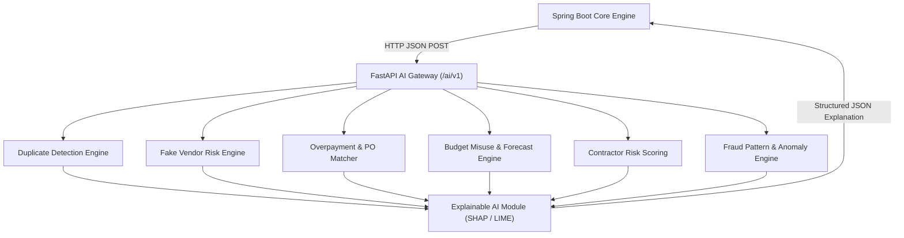

# AI Budget Guardian — AI/ML Service Architecture Specification

## 1. Overview
The AI Engine is a standalone FastAPI Python microservice delivering real-time anomaly detection, risk evaluation, predictive budget forecasting, duplicate invoice matching, and Explainable AI (XAI) feature attribution via SHAP and LIME.

---

## 2. AI Service Architecture Diagram



---

## 3. Core AI Modules & Algorithm Mapping

| Module Name | AI/ML Approach | Algorithm / Methodology | Output |
|---|---|---|---|
| **Duplicate Invoice Detection** | Rule-based + Fuzzy Matching + Text Embeddings | Levenshtein Distance, Jaro-Winkler, Cosine Similarity on Invoice Text/Amount/Date/Vendor | Duplicate Probability (0–100%), Matching Fields, Matching Target Invoice ID |
| **Fake Vendor Detection** | Identity Graph & Supervised Classification | Graph-like identity clustering (Shared GST/PAN/Bank/Address) + XGBoost Classifier | Risk Score (0-100), Risk Level (LOW..CRITICAL), Flagged Identity Overlaps |
| **Overpayment Detection** | Multi-Factor Reconciliation | PO Price vs Invoice Price Deviation, Historical Item Benchmark Comparison | Overpayment Amount ($/₹), Risk Score, Line Item Variance |
| **Budget Misuse & Forecasting** | Time-Series Forecasting + Regression | Prophet / SARIMAX / XGBoost Regressor | Projected Exhaustion Date, Estimated Overspend Amount, Burn Rate Anomaly Score |
| **Contractor Risk Model** | Weighted Multi-Factor Scoring + Random Forest | Random Forest Classification on Delays, Penalties, Budget Overruns, Cancellation Rates | Contractor Risk Score (0-100), Risk Classification |
| **Fraud Pattern & Anomaly Engine** | Unsupervised Anomaly Detection | Isolation Forest + Local Outlier Factor (LOF) + Split/Midnight Transaction Heuristics | Anomaly Score (-1.0 to +1.0), Flagged Rule Violations (e.g. Split Payment, Off-hours) |
| **Explainable AI (XAI)** | Model Interpretability | SHAP (SHapley Additive exPlanations) & LIME | Base Value, Feature Contributions, Ranked Feature Impact List |

---

## 4. Structured AI Response Protocol

Every AI endpoint returns a uniform, interpretable JSON structure:

```json
{
  "riskScore": 87.5,
  "riskLevel": "HIGH",
  "confidence": 0.94,
  "prediction": "Suspicious transaction detected with potential overpayment and duplicate vendor identity.",
  "reasons": [
    "Invoice amount is 38.2% above historical price benchmark for item category.",
    "Vendor shares bank account number with another registered vendor (ID: v-8821).",
    "Transaction was submitted at 02:14 AM outside standard operating hours."
  ],
  "features": [
    {
      "name": "price_variance_pct",
      "value": 38.2,
      "impact": 0.42,
      "description": "High price deviation from purchase order benchmark"
    },
    {
      "name": "shared_bank_account",
      "value": 1,
      "impact": 0.35,
      "description": "Multiple vendors using identical bank account details"
    },
    {
      "name": "submission_hour",
      "value": 2,
      "impact": 0.17,
      "description": "Off-hours submission window"
    }
  ],
  "recommendedAction": "Escalate to Auditor Review and place payment on temporary hold."
}
```

---

## 5. Model Training & Evaluation Pipeline
1. **Data Preprocessing**: Handling missing fields, standard scaling continuous features, encoding categorical attributes, generating synthetic government transaction datasets simulating fraud vectors.
2. **Train/Validation/Test Split**: 70% Train, 15% Validation, 15% Test.
3. **Evaluation Metrics**:
   - Classification (Fake Vendor, Fraud Patterns): Accuracy, Precision, Recall, F1-Score, ROC-AUC (> 0.90 threshold).
   - Anomaly Detection: Precision@K, Review Yield Rate.
   - Forecasting: MAE, RMSE, MAPE (< 8% error margin).
