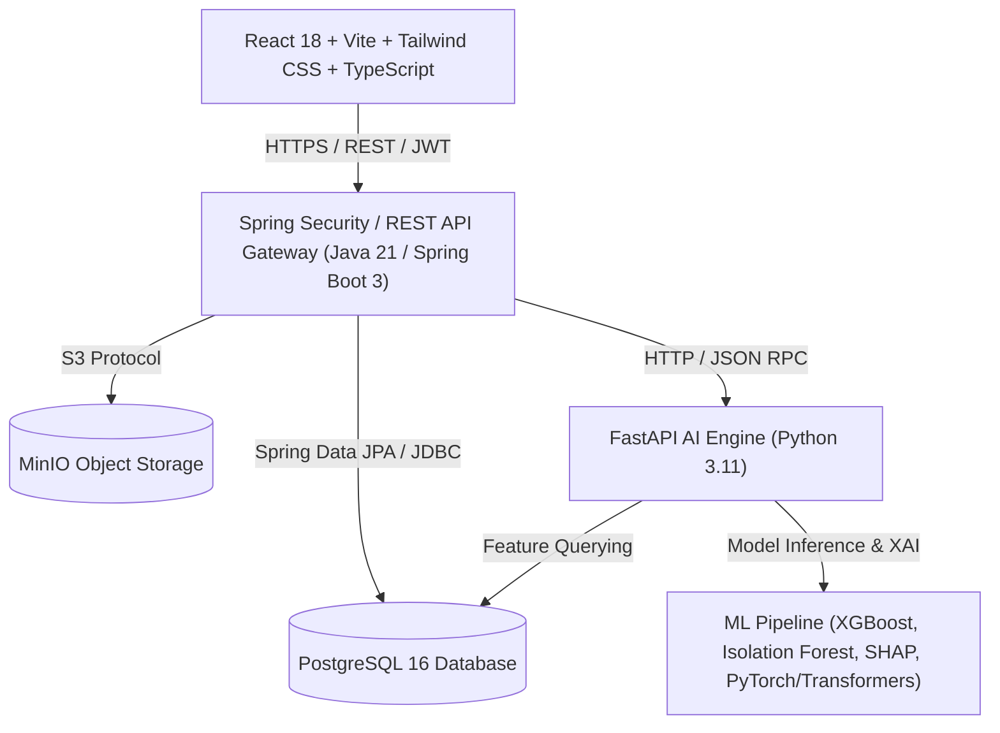
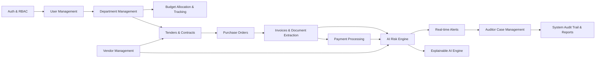

# AI Budget Guardian — System Architecture Specification

## 1. Executive Overview
AI Budget Guardian is an enterprise-grade, intelligent government financial monitoring platform designed to analyze budget allocations, track expenditure lifecycles (Tender -> Vendor -> Purchase Order -> Invoice -> Payment), automatically detect financial anomalies, fraud patterns, and duplicate invoices, and provide Explainable AI (XAI) insights for auditors and department managers.

## 2. Architectural Layers

### Layer 1: Presentation Layer (Frontend)
- **Framework**: React 18 with Vite, TypeScript
- **State Management & Data Fetching**: TanStack Query (React Query v5)
- **Table & Visualization**: TanStack Table v8, Recharts
- **Styling**: Tailwind CSS with custom government finance design system
- **Routing**: React Router v6 (Nested routes with RBAC layout wrappers)

### Layer 2: Application Layer (Backend Gateway & Core Business Logic)
- **Framework**: Java 21 LTS with Spring Boot 3.x
- **Security**: Spring Security 6 with JWT (Access Token 15m + Refresh Token 7d), RBAC & Fine-grained Permission Authority (`@PreAuthorize`)
- **Persistence**: Spring Data JPA, Hibernate ORM, Liquibase / Flyway migration
- **Auditing**: Spring Data JPA Entity Listeners (`@Audited`, custom `AuditLogAspect`)

### Layer 3: Intelligence & Analytics Layer (AI/ML Engine)
- **Framework**: Python 3.11 with FastAPI, Uvicorn
- **ML/Analytics Libraries**: XGBoost, Scikit-learn, Pandas, NumPy, SHAP, LIME, RapidFuzz
- **Async Execution**: Real-time evaluation hooks invoked synchronously during transaction lifecycle with event-driven background queues for heavy retraining.

### Layer 4: Storage & Infrastructure Layer
- **Relational DB**: PostgreSQL 16 (Normalized schema with spatial/text indexing)
- **Document/File Storage**: MinIO (S3-compatible object storage for Invoice PDFs and proof evidence)
- **Containerization**: Docker & Docker Compose orchestrating all microservices.

---

## 3. Core Module Dependency Map

