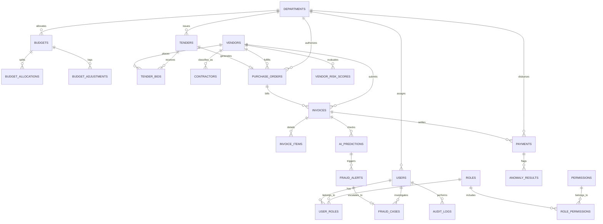

# AI Budget Guardian — Database ER & Schema Design

## 1. Overview
The database schema for AI Budget Guardian is fully normalized (3NF) and designed for high integrity financial auditing, complete audit traceability, soft-deletion capabilities, foreign key enforcement, indexed search parameters, and unified anomaly/case tracking.

---

## 2. Database Entity Map & Relations

---

## 3. Detailed Entity Schemas

### 3.1 Authentication & RBAC Core
- `users`: `id (UUID)`, `email (VARCHAR unique)`, `password_hash`, `full_name`, `department_id (FK)`, `status (ACTIVE, INACTIVE, LOCKED)`, `failed_attempts`, `last_login_at`, `created_at`, `updated_at`.
- `roles`: `id (BIGINT)`, `code (VARCHAR unique)`, `name`, `description`. Standard roles: `SUPER_ADMIN`, `FINANCE_OFFICER`, `DEPARTMENT_MANAGER`, `AUDITOR`.
- `permissions`: `id (BIGINT)`, `code (VARCHAR unique)`, `module`, `description`. Examples: `budget:approve`, `invoice:create`, `fraud:investigate`.
- `user_roles`: `user_id (FK)`, `role_id (FK)`.
- `role_permissions`: `role_id (FK)`, `permission_id (FK)`.

### 3.2 Financial & Budget Management
- `departments`: `id (UUID)`, `code (VARCHAR unique)`, `name`, `description`, `annual_budget`, `quarterly_budget`, `monthly_budget`, `used_budget`, `remaining_budget`, `manager_id (FK)`, `finance_officer_id (FK)`, `status`.
- `budgets`: `id (UUID)`, `department_id (FK)`, `financial_year (e.g. FY2025-26)`, `allocated_amount`, `used_amount`, `remaining_amount`, `burn_rate_monthly`, `projected_exhaustion_date`, `status (HEALTHY, WARNING, CRITICAL, EXCEEDED)`.
- `budget_adjustments`: `id (UUID)`, `budget_id (FK)`, `type (TRANSFER, REALLOCATION, INCREASE, REDUCTION)`, `amount`, `reason`, `requested_by (FK)`, `approved_by (FK)`, `status (PENDING, APPROVED, REJECTED)`.

### 3.3 Procurement & Vendor Integrity
- `vendors`: `id (UUID)`, `vendor_name`, `gst_number (indexed)`, `pan_number (indexed)`, `bank_account_no (indexed)`, `ifsc_code`, `address`, `contact_email`, `contact_phone`, `category`, `status (ACTIVE, BLACKLISTED, UNDER_REVIEW)`, `blacklist_reason`, `risk_score (0-100)`, `risk_level (LOW, MEDIUM, HIGH, CRITICAL)`.
- `vendor_risk_scores`: `id (UUID)`, `vendor_id (FK)`, `score`, `risk_level`, `duplicate_gst_flag`, `duplicate_pan_flag`, `duplicate_bank_flag`, `same_address_flag`, `blacklisted_flag`, `explanation_json`, `evaluated_at`.
- `contractors`: `id (UUID)`, `vendor_id (FK)`, `company_name`, `total_projects`, `completed_projects`, `delayed_projects`, `cancelled_projects`, `complaints_count`, `penalties_amount`, `performance_rating (1.0-5.0)`, `risk_score`.
- `tenders`: `id (UUID)`, `tender_number`, `department_id (FK)`, `title`, `estimated_cost`, `winning_bid_amount`, `winning_vendor_id (FK)`, `number_of_bidders`, `status (DRAFT, PUBLISHED, EVALUATION, AWARDED, IN_PROGRESS, COMPLETED, CANCELLED)`, `tender_risk_score`.

### 3.4 Operational Transactions (PO, Invoice, Payment)
- `purchase_orders`: `id (UUID)`, `po_number (unique)`, `department_id (FK)`, `vendor_id (FK)`, `tender_id (FK null)`, `total_amount`, `status (DRAFT, SUBMITTED, APPROVED, REJECTED, COMPLETED)`, `approved_by (FK)`.
- `invoices`: `id (UUID)`, `invoice_number (indexed)`, `vendor_id (FK)`, `department_id (FK)`, `po_id (FK)`, `amount`, `gst_amount`, `invoice_date`, `due_date`, `document_url`, `duplicate_probability (0-100%)`, `duplicate_flag (BOOLEAN)`, `approval_status`, `payment_status`.
- `invoice_items`: `id (UUID)`, `invoice_id (FK)`, `item_name`, `quantity`, `unit_price`, `total_price`.
- `payments`: `id (UUID)`, `payment_reference (unique)`, `invoice_id (FK)`, `vendor_id (FK)`, `department_id (FK)`, `amount`, `payment_date`, `payment_mode`, `finance_officer_id (FK)`, `status (PENDING, UNDER_REVIEW, APPROVED, REJECTED, PAID, FLAGGED)`, `transaction_timestamp`.

### 3.5 AI, Anomaly & Case Management
- `ai_predictions`: `id (UUID)`, `entity_type (INVOICE, VENDOR, BUDGET, CONTRACTOR, TENDER, TRANSACTION)`, `entity_id (UUID)`, `model_name`, `model_version`, `risk_score`, `risk_level`, `confidence`, `prediction_type`, `explanation_json (SHAP/LIME breakdown)`, `recommended_action`.
- `fraud_alerts`: `id (UUID)`, `alert_code`, `severity (LOW, MEDIUM, HIGH, CRITICAL)`, `entity_type`, `entity_id`, `vendor_id (FK)`, `department_id (FK)`, `title`, `description`, `status (NEW, IN_PROGRESS, RESOLVED, DISMISSED)`.
- `fraud_cases`: `id (UUID)`, `case_number (unique)`, `alert_id (FK)`, `assigned_auditor_id (FK)`, `vendor_id (FK)`, `department_id (FK)`, `severity`, `status (OPEN, UNDER_INVESTIGATION, EVIDENCE_REVIEW, FINDINGS_SUBMITTED, CLOSED_RESOLVED, CLOSED_DISMISSED)`, `findings`, `resolution_notes`, `evidence_files_json`.
- `audit_logs`: `id (UUID)`, `user_id (FK)`, `user_email`, `action`, `entity_type`, `entity_id`, `ip_address`, `before_state_json`, `after_state_json`, `timestamp`.
