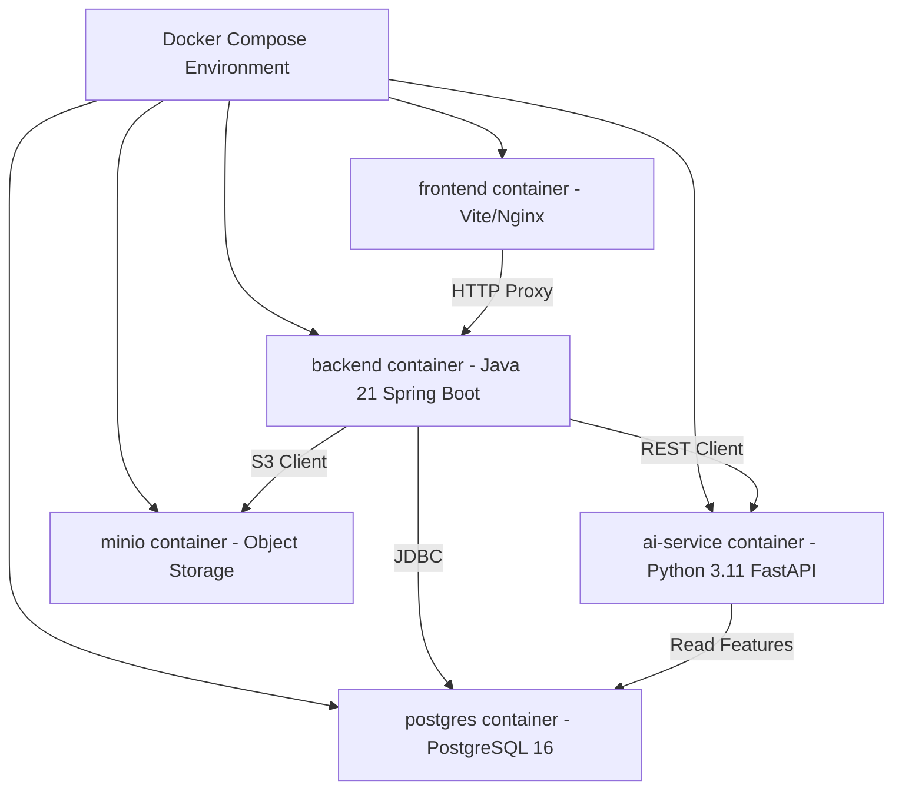

# AI Budget Guardian — Deployment & Infrastructure Specification

## 1. Containerization & Orchestration Architecture
AI Budget Guardian is containerized using Docker and orchestrated using Docker Compose for local development, enterprise staging, and production readiness.

---

## 2. Service Environment Matrix

| Service Name | Container Name | Internal Port | Exposed Port | Environment Variables |
|---|---|---|---|---|
| **Frontend UI** | `aibudget-frontend` | 80 | 80 / 5173 | `VITE_API_BASE_URL` |
| **Backend REST API** | `aibudget-backend` | 8080 | 8080 | `SPRING_DATASOURCE_URL`, `JWT_SECRET`, `AI_SERVICE_URL`, `MINIO_URL` |
| **AI FastAPI Service** | `aibudget-ai-service` | 8000 | 8000 | `DB_HOST`, `DB_USER`, `DB_PASSWORD`, `MODEL_PATH` |
| **PostgreSQL Database** | `aibudget-postgres` | 5432 | 5432 | `POSTGRES_DB`, `POSTGRES_USER`, `POSTGRES_PASSWORD` |
| **MinIO Object Store** | `aibudget-minio` | 9000 / 9001 | 9000 / 9001 | `MINIO_ROOT_USER`, `MINIO_ROOT_PASSWORD` |

---

## 3. Health Monitoring & Recovery
- All containers include standard Docker health checks:
  - Backend: `/actuator/health`
  - AI Service: `/ai/v1/health`
  - Postgres: `pg_isready -U postgres`
- Restart Policy: `always` for daemon components.
